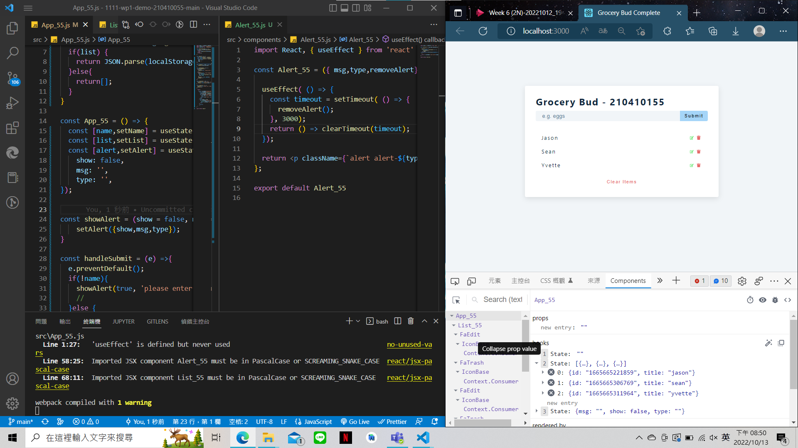
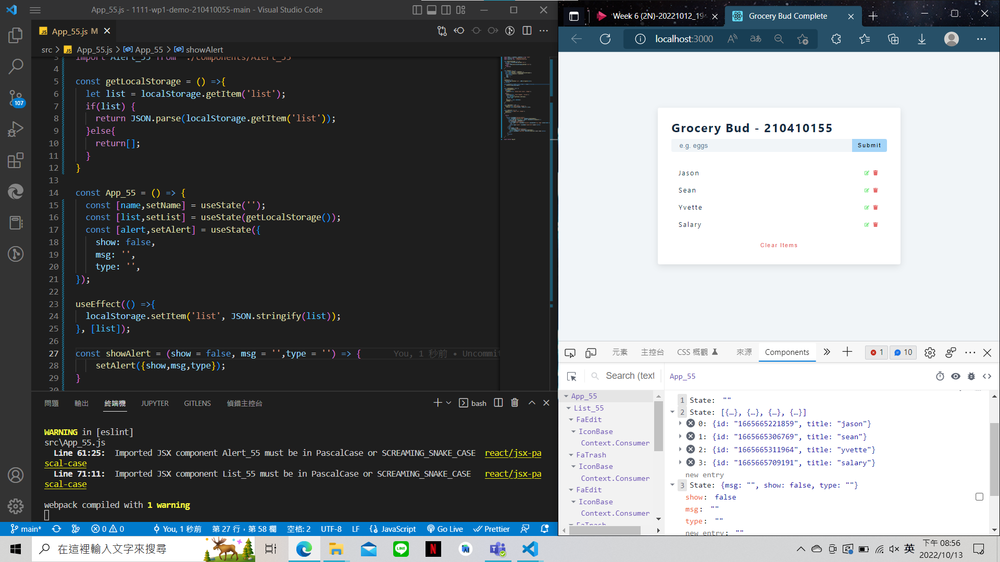
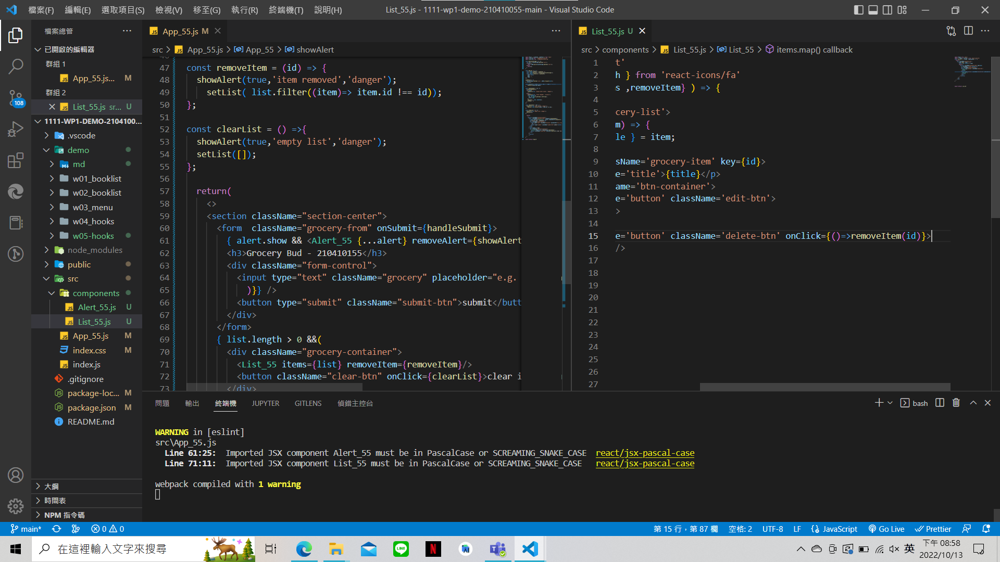

### Github URL

[Github URL](https://github.com/210410055/1111-wp1-demo-210410055-main)

### W06-P1: Use DevTools to exam useState values

### W06-P2: Show <Alert_55 /> and <List_55 />

### W06-P3: Using localStorage to save list data

### W06-P4: Add function for removing item and clearing list

